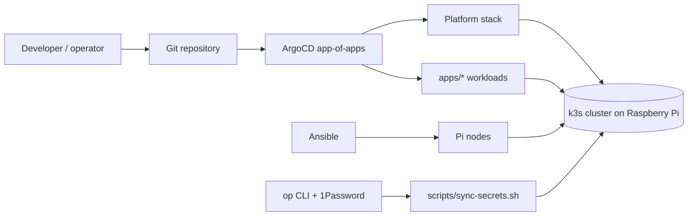

# Raspberry Pi Kubernetes Cluster

Production homelab Kubernetes on Raspberry Pi 4B nodes, running k3s for home-network infrastructure (Pi-hole DNS, chrony NTP, PostgreSQL) and public services such as the bmtn.us Shlink URL shortener. This repo is being overhauled from imperative provisioning/deploy scripts to GitOps: Ansible prepares nodes, ArgoCD reconciles cluster state from Git, and a workstation push-sync script (`scripts/sync-secrets.sh`) seeds runtime secrets from 1Password into the cluster.

## Repository map

| Path | Role |
| --- | --- |
| `ansible/` | Node provisioning and adoption automation (`provision.yml`, `adopt.yml`, `bootstrap-node.sh`). |
| `platform/` | Shared GitOps platform stack: cert-manager, longhorn, security, data, monitoring, descheduler. |
| `apps/` | Leaf workloads; one app per folder, discovered by the ArgoCD ApplicationSet. |
| `clusters/` | Per-cluster ArgoCD control plane (`clusters/rpi/root.yml` app-of-apps). |
| `bootstrap/` | Imperative bootstrap script for ArgoCD and first root app handoff. |
| `secrets/` | Committed Kubernetes Secret templates with `op://` references, pushed from 1Password by `scripts/sync-secrets.sh`. |
| `scripts/` | Operator helpers: `validate.sh` (CI checks), `apply.sh` (push/break-glass), `sync-secrets.sh` (push secrets from 1Password), `backup.sh` (pre-migration capture). |
| `docs/` | Architecture, GitOps, secrets, provisioning, variable inventory, and runbooks. |
| `docker/` | Standalone Docker Compose services not yet in k3s/GitOps (secrets via `docker/.env`). |
| `.github/workflows/` | CI: runs `scripts/validate.sh` (kustomize build, helm template, secret scan, prune-policy guard) on PRs. |
| `renovate.json` | Automated dependency-update PRs for images, Helm charts, and Actions (replaces Watchtower; stateful components gated). |

## Deployment model

ArgoCD starts observed-only: no automated sync is committed initially. See [docs/gitops.md](docs/gitops.md) for sync waves and promotion gates.

## Start here

- Architecture: [docs/architecture.md](docs/architecture.md)
- Provisioning and adoption: [docs/provisioning.md](docs/provisioning.md)
- Secrets model: [docs/secrets.md](docs/secrets.md)
- Bootstrap order: [docs/runbooks/bootstrap.md](docs/runbooks/bootstrap.md)
- Break-glass operations: [docs/runbooks/break-glass.md](docs/runbooks/break-glass.md)
- Pi-hole migration: [docs/runbooks/pihole-migration.md](docs/runbooks/pihole-migration.md)
- Disaster recovery: [docs/runbooks/disaster-recovery.md](docs/runbooks/disaster-recovery.md)
