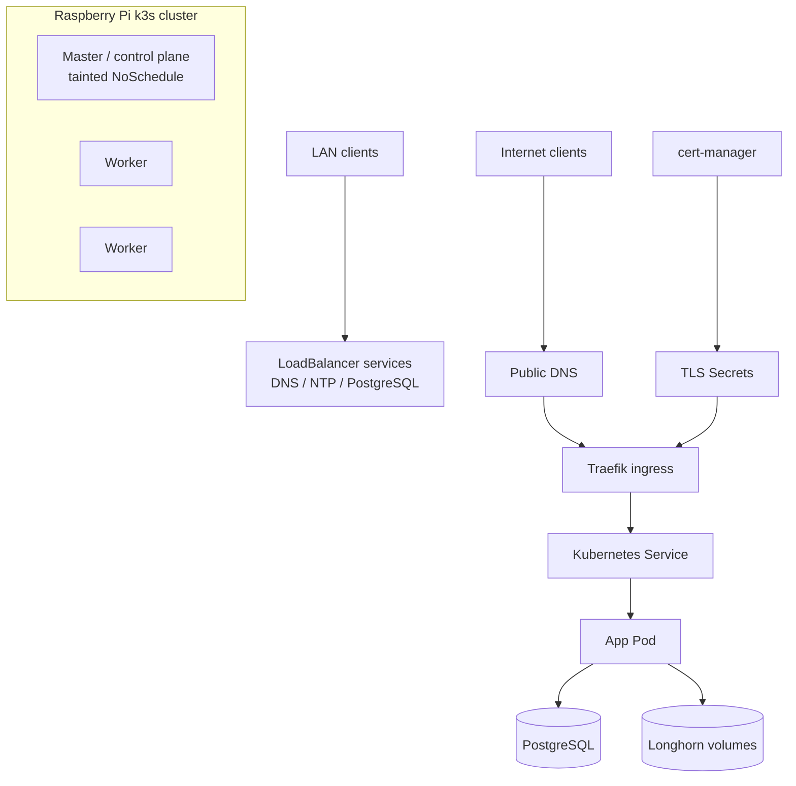
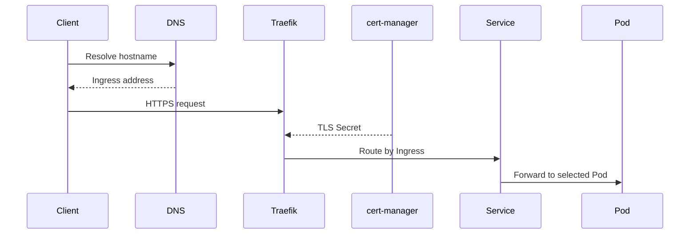

# Architecture

This is a live production homelab k3s cluster on Raspberry Pi 4B ARM64 nodes. It provides LAN infrastructure and public HTTP(S) services from a small, failure-conscious platform.

## Topology

- k3s control plane: one master node, tainted `NoSchedule` so workloads run on the agents.
- Workers: Raspberry Pi 4B nodes run most workloads.
- Ingress: k3s Traefik handles HTTP(S) ingress.
- Storage: Longhorn provides replicated block storage on Pi-attached storage.
- LAN LoadBalancers: Pi-hole, chrony, PostgreSQL, and similar services use LoadBalancer IPs via MetalLB or k3s ServiceLB (verify which implementation is live).
- DNS: Pi-hole is the LAN resolver and must be migrated last.
- NTP: chrony serves time to the LAN.
- Data: PostgreSQL in `platform/data` backs apps such as Shlink.

## Platform vs apps

- `platform/` is shared cluster infrastructure: cert-manager, Longhorn, security/Traefik middleware, PostgreSQL, monitoring, and descheduler. Secrets are pushed from 1Password by `scripts/sync-secrets.sh` (see [secrets.md](secrets.md)), not managed by an in-cluster operator.
- `apps/` contains leaf workloads with minimal blast radius.
- `clusters/rpi/` wires both through ArgoCD: `root.yml` renders `platform-apps.yml` and `apps-appset.yml`.

The sync-wave order and promotion gates are in [gitops.md](gitops.md); this page only summarizes the dependency shape.

## External HTTPS request flow

1. A client resolves the public hostname, e.g. `bmtn.us`, via external DNS.
2. The request reaches the home ingress endpoint and Traefik.
3. Traefik matches an `Ingress`, terminates TLS using a cert-manager-managed Secret, and forwards to a Kubernetes `Service`.
4. The Service selects a Pod.
5. The Pod reads config from ConfigMaps and Secrets; non-secret config comes from the `cluster-config` component, and secret values are pushed into etcd from 1Password by `scripts/sync-secrets.sh`. Stateful dependencies use PostgreSQL or Longhorn-backed volumes.

## Critical services

- Pi-hole: home DNS; outage affects cluster and operator name resolution.
- chrony: LAN time source.
- PostgreSQL: shared application database in the platform layer.
- Shlink: public URL shortener for `bmtn.us`.

Any migration must be additive, observed, and reversible. Never tear down live services to adopt them into GitOps.
