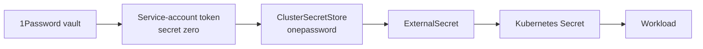

# Secrets

Secrets are intentionally lightweight: 1Password is the source of truth, External Secrets Operator (ESO) syncs into Kubernetes, and one service-account token is the only secret outside 1Password.

## Flow



- ESO provider: `onepasswordSDK`.
- `ClusterSecretStore`: `onepassword` in `platform/external-secrets/clustersecretstore.yml`.
- API version: `external-secrets.io/v1`.
- `remoteRef.key`: `"<item>/[section/]<field>"`.
- Secret zero: Kubernetes Secret `external-secrets/onepassword-token` with key `token`, created by `bootstrap/10-secret-zero.sh`.

## Example ExternalSecret

```yaml
apiVersion: external-secrets.io/v1
kind: ExternalSecret
metadata:
  name: shlink-secret
  annotations:
    argocd.argoproj.io/sync-wave: "-1"
spec:
  refreshInterval: 1h
  secretStoreRef:
    name: onepassword
    kind: ClusterSecretStore
  target:
    name: shlink-secret
    creationPolicy: Owner
    deletionPolicy: Retain
  data:
    - secretKey: DB_PASSWORD
      remoteRef:
        key: "postgres/password"
    - secretKey: SHLINK_SERVER_API_KEY
      remoteRef:
        key: "shlink/api-key"
```

Use `deletionPolicy: Retain` for critical secrets so deleting an ExternalSecret does not delete the live Secret.

## Failure modes

- If 1Password or the Internet is unavailable, existing Kubernetes Secrets keep serving running and restarting Pods.
- Only new secrets, refreshes, and rotations fail while ESO cannot reach 1Password.
- Alert on `ExternalSecret` sync failures and stale `Ready=False` conditions.

Useful checks:

```sh
kubectl get externalsecrets -A
kubectl describe externalsecret -n <namespace> <name>
kubectl get clustersecretstore onepassword -o yaml
```

## Token rotation

1. Create a new 1Password service-account token with access to the homelab vault.
2. Update secret zero:
   ```sh
   kubectl -n external-secrets create secret generic onepassword-token \
     --from-literal=token='<new-token>' \
     --dry-run=client -o yaml | kubectl apply -f -
   ```
3. Restart ESO if needed or wait for refresh.
4. Confirm `ClusterSecretStore` and representative `ExternalSecret` objects are `Ready`.
5. Revoke the old token in 1Password.

## Emergency manual Secret

When ESO is down and a critical rotation cannot wait:

1. Create or patch the Kubernetes Secret manually with the same name and keys.
2. Keep `deletionPolicy: Retain` on the ExternalSecret.
3. Record exactly what changed.
4. Restore the value in 1Password and reconcile the ExternalSecret when ESO is healthy.

## Adding a secret

1. Add the value to the 1Password homelab vault.
2. Add an `ExternalSecret` beside the workload or platform component.
3. Reference `secretStoreRef.name: onepassword`.
4. Sync the ExternalSecret first and wait for the target Secret.
5. Then sync the workload that consumes it.

## Cleanup TODOs

- `.env.sample` contains a real-looking `UPTIME_PASSWORD`; rotate it and replace with a placeholder.
- `docker/scrypted.yml` hardcodes tokens; rotate and parameterize them.

See [variable-inventory.md](variable-inventory.md) for the migration inventory.
