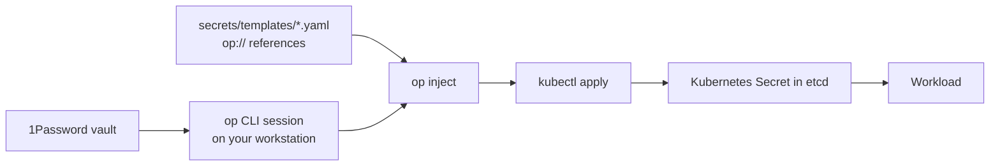

# Secrets

Secrets are intentionally lightweight and **homelab-friendly**: **1Password is
the source of truth**, and a small workstation script **pushes** the private
values into the cluster as Kubernetes Secrets. Nothing in the cluster
authenticates to 1Password, so there is no operator and no runtime dependency on
1Password at all. An optional workstation-only service account can authenticate
the push script non-interactively; its token never goes into the cluster.

> **Why push, not pull?** External Secrets Operator's 1Password providers
> (`onepasswordSDK`/Connect) pull from 1Password's hosted API and need a
> credential with direct **SaaS access** — a Connect server or a Business/Teams
> service account — deployed *inside* the cluster, a permanent runtime dependency
> on 1Password. A Family plan *can* create a service account, but only for
> **local desktop CLI** use (`op` with `OP_SERVICE_ACCOUNT_TOKEN`), not the
> hosted SaaS access ESO requires. The push-sync model only ever uses the local
> `op` CLI, so it works on a Family (or personal) plan — and every form of
> 1Password auth (an interactive `op` session, or the optional **read-only**
> workstation service account described below) stays on the workstation and
> never enters the cluster.

The guiding rule is unchanged: **only genuinely private values go to 1Password.**
Non-secret, cluster-specific values (hostnames, LAN IPs, timezone, UID/GID,
public domains) are *not* secrets — they live in the `cluster-config` Kustomize
component (`components/cluster-config`), not in 1Password. See
[gitops.md](gitops.md#non-secret-fan-out-cluster-config) and
[variable-inventory.md](variable-inventory.md).

## Flow



- Tool: `scripts/sync-secrets.sh` (push-sync), run from a workstation that has
  `op` (signed in) and `kubectl` (pointed at the cluster).
- Templates: `secrets/templates/*.yaml` — each is a complete Kubernetes Secret
  manifest whose values are 1Password references `{{ op://$OP_VAULT/item/field }}`.
- Resolver: `op inject` replaces the references; `kubectl apply` upserts the
  Secret. No plaintext is ever written to disk or passed on argv.
- There is **no secret zero** and **no ClusterSecretStore** — the cluster never
  holds a 1Password credential.

## Running a sync

```sh
# Prereqs: `op` installed + signed in (eval $(op signin) or desktop integration),
# kubectl pointed at the cluster (KUBECONFIG / context set).

scripts/sync-secrets.sh               # sync every secret + postgres fan-out
scripts/sync-secrets.sh shlink        # sync one (template basename)
scripts/sync-secrets.sh postgres-app  # sync only the shared postgres fan-out
scripts/sync-secrets.sh --dry-run     # resolve + validate references, apply nothing
```

Environment:

| Var | Default | Purpose |
| --- | --- | --- |
| `OP_VAULT` | `homelab` | 1Password vault holding the homelab items. |
| `OP_ACCOUNT` | _(unset)_ | Account shorthand / sign-in address for multi-account interactive `op` setups (e.g. `themartinezfamily.1password.com`). |
| `OP_SERVICE_TOKEN_KEYCHAIN_ITEM` | `op-service-token-homelab` | macOS Keychain item name for the optional service-account token. |

The script runs a **validation pass first** — it `op inject`s every selected
template and aborts before touching the cluster if any reference fails to
resolve, so a typo never leaves you with a half-applied set of Secrets.


## Optional: Non-interactive sync via a 1Password service account

The default path remains an interactive `op` session, but operators may configure
a read-only service account to avoid per-item biometric prompts. This is useful
for hands-free disaster-recovery re-pushes after etcd loss or cluster rebuilds.

Operator setup (do this manually, not from an agent):

1. Create a 1Password service account with **read-only** access to only the
   `homelab` vault.
2. Store its token in macOS Keychain. Copy the full `ops_…` token to your
   clipboard first, then store it *from the clipboard* — a very long token can be
   silently truncated if pasted into an interactive prompt:
   ```sh
   pbpaste | wc -c   # sanity-check length (~800+ chars) before storing
   security add-generic-password -U -a "$USER" -s "op-service-token-homelab" -w "$(pbpaste)"
   pbcopy </dev/null # clear the clipboard afterward
   ```
3. Never commit or print the token. Rotate it immediately if it is exposed.

When `scripts/sync-secrets.sh` runs outside `--verify`, it first checks whether
`OP_SERVICE_ACCOUNT_TOKEN` is already set. If not, and macOS Keychain is
available, it reads the configured Keychain item into that environment variable
at runtime. If no service-account token is available, the script falls back to
the existing interactive `op` session behavior.

Use `OP_SERVICE_TOKEN_KEYCHAIN_ITEM` to override the Keychain item name when
needed. Service-account auth intentionally does not pass `OP_ACCOUNT`, because
`OP_SERVICE_ACCOUNT_TOKEN` selects the account context.

Keep the service account least-privilege: read-only, scoped only to `homelab`,
and independently revocable from any human operator account. Rotate the token on
a regular schedule and after operator workstation changes.

## The 1Password item model (one item per app)

To keep mapping effort minimal, each app/namespace maps to **one 1Password
item** named after the app, in the `homelab` vault. Its **field labels equal the
Kubernetes Secret keys** the workload consumes (which usually equal the env var
names). The template lists each key once:

```yaml
# secrets/templates/shlink.yaml
apiVersion: v1
kind: Secret
metadata:
  name: shlink-secret          # == the Secret the deployment already mounts
  namespace: shlink
type: Opaque
stringData:
  SHLINK_SERVER_API_KEY: "{{ op://$OP_VAULT/shlink/SHLINK_SERVER_API_KEY }}"
  GEOLITE_LICENSE_KEY: "{{ op://$OP_VAULT/shlink/GEOLITE_LICENSE_KEY }}"
```

> **Convention:** name the 1Password fields exactly as the Secret keys the
> workload expects. Then `envFrom: secretRef` needs zero per-field wiring, and
> adding a field is a one-line edit to the template.

The Secret **names and keys are identical** to what the workloads already mount,
so switching from ESO to push-sync required **no workload manifest changes** —
only the source of the Secret changed.

## Shared secrets — define once, flow everywhere

Some secrets are needed by several namespaces. Instead of repeating a template
per namespace, the shared PostgreSQL password is **fanned out** to every
namespace that opts in with a label. This is the push-sync analog of the old
`envsubst` `${POSTGRES_PASSWORD}` spray and of ESO's `ClusterExternalSecret`.

`secrets/postgres-app.tpl.yaml` renders a `postgres-app` Secret (key `password`)
into every namespace labeled `postgres-client=true`:

```yaml
# secrets/postgres-app.tpl.yaml
apiVersion: v1
kind: Secret
metadata:
  name: postgres-app
  namespace: __NAMESPACE__        # sed-substituted per matching namespace
type: Opaque
stringData:
  password: "{{ op://$OP_VAULT/postgres/password }}"
```

```yaml
# the consuming namespace opts in
metadata:
  name: shlink
  labels: { postgres-client: "true" }
```

```yaml
# the consuming workload maps it to whatever env var it wants
env:
  - name: DB_PASSWORD
    valueFrom: { secretKeyRef: { name: postgres-app, key: password } }
```

`scripts/sync-secrets.sh` queries `kubectl get ns -l postgres-client=true`,
renders the template **once**, and applies it per matching namespace. Add a new
database client later = **label its namespace** and re-run the sync; no new
template, and rotation happens in exactly one place.

**When NOT to fan out:**

- The PostgreSQL **server** (`platform/data`) keeps its own `data-secret`
  template (`POSTGRES_PASSWORD`) — never reshape the critical DB's secret wiring
  to chase DRY.
- Consumers that **template/reshape** the password keep their own template
  pulling the same `postgres` item. `monitoring.yaml` builds
  `GF_DATABASE_PASSWORD` and the Grafana admin secret; `meal-planner.yaml`
  composes a `DATABASE_URL`. The 1Password *entry* is still single-source; only
  the rendered shape differs.
- **Traefik basic-auth** is referenced cross-namespace by middleware name
  (`security-basicauth@kubernetescrd`), so `basicauth-user` only needs to exist
  in the `security` namespace — a plain template, not a fan-out.

## Composing values with references

When a workload needs a value that *embeds* a secret (a connection string, an
htpasswd line), store only the secret in 1Password and write the rest as
literal text around the reference — keeping non-secret parts out of the vault:

```yaml
# secrets/templates/meal-planner.yaml
stringData:
  DATABASE_URL: "postgres://rpi:{{ op://$OP_VAULT/postgres/password }}@pgbouncer.data:5432/mealplanner"
```

Only the password is private; the host, user, and database name are literal.

## Outage resilience — the cluster keeps running without 1Password

Push-sync writes durable Kubernetes Secrets into etcd; **nothing in the cluster
talks to 1Password at runtime.** This is strictly more resilient than the pull
model:

| Scenario | Effect on the cluster |
| --- | --- |
| 1Password unreachable (internet/DNS outage) | **Zero impact.** The cluster never contacts 1Password; existing Secrets are untouched. Only running `sync-secrets.sh` would fail. |
| A pod restarts during the outage | **Fine.** It reads the existing Secret from etcd. |
| A node or the whole cluster reboots | **Fine.** Secrets persist in etcd across reboots; nothing recreates them. |
| You try to **rotate** or add a **new** secret | Blocked only until you can sign in to `op` again and re-run the script. |
| **Disaster recovery** (etcd lost) | Re-run `sync-secrets.sh` to repopulate from 1Password. Keep an offline emergency copy of critical creds (1Password Emergency Kit). |

There is **no circular DNS dependency**: because the cluster never resolves
`*.1password.com`, a Pi-hole/DNS outage cannot block secret availability. (Your
*workstation* needs DNS + internet to run a sync, but that is off the cluster's
critical path.)

ArgoCD does **not** manage these Secrets — they are deliberately outside GitOps
so a sync/prune can never delete a live Secret. `kubectl apply` upserts in place;
re-running the script is always safe and idempotent.

Useful checks:

```sh
kubectl get secret -A | grep -E 'shlink-secret|postgres-app|monitoring-secret'
kubectl get ns -l postgres-client=true
scripts/sync-secrets.sh --dry-run        # confirm every reference still resolves
```

## Rotation

Rotation is just "change it in 1Password, then re-push":

1. Update the field value in the relevant 1Password item.
2. Re-run the sync for that secret:
   ```sh
   scripts/sync-secrets.sh <app>        # e.g. shlink, or postgres-app
   ```
3. Restart the consuming workload if it doesn't hot-reload the Secret:
   ```sh
   kubectl rollout restart deployment/<name> -n <namespace>
   ```

For the shared postgres password, rotate it in 1Password once, re-run
`scripts/sync-secrets.sh postgres-app`, then roll the DB and its clients.

## Emergency manual Secret (break-glass)

Because Secrets are plain etcd objects and nothing reconciles them, break-glass
is trivial — there is no operator to fight:

1. Create or patch the Kubernetes Secret manually with the same name and keys:
   ```sh
   kubectl -n <ns> create secret generic <name> \
     --from-literal=<KEY>='<value>' \
     --dry-run=client -o yaml | kubectl apply -f -
   ```
2. Record exactly what changed.
3. Update the value in 1Password and re-run `scripts/sync-secrets.sh` when
   convenient — `kubectl apply` will reconcile your manual value to match.

## Adding a secret

1. Create/extend the app's **item** in the 1Password `homelab` vault; name fields
   to match the Secret keys the workload expects.
2. Add (or extend) a template in `secrets/templates/<app>.yaml` referencing those
   fields with `{{ op://$OP_VAULT/<item>/<field> }}`. For a shared value, label
   the consuming namespace `postgres-client=true` instead.
3. Validate: `scripts/sync-secrets.sh <app> --dry-run`.
4. Push: `scripts/sync-secrets.sh <app>`, then deploy/roll the workload.

## Cleanup TODOs

- `.env.sample` previously contained a real-looking `UPTIME_PASSWORD` — rotate it
  (it remains in git history) and keep only a placeholder.
- `docker/scrypted.yml` previously hardcoded tokens — rotate them and source from
  `docker/.env`.

See [variable-inventory.md](variable-inventory.md) for the full migration inventory.
